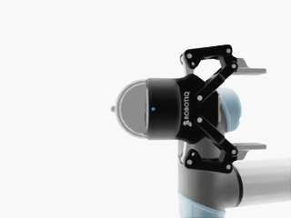
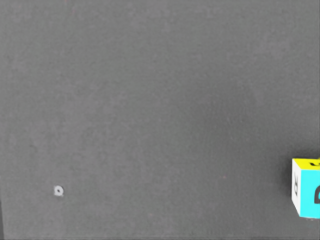
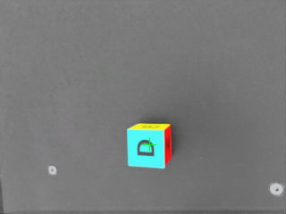

# 04 — Layer 2: Image-Based Visual Servoing (IBVS)

**Status:** ▶ IN PROGRESS — Phase 1 (camera) done; Phase 2 (classical IBVS baseline) **built and
partially working** · **Layer:** 2 (stretch) · **Roadmap:** Weeks 11–13

> Layer 2 was started only after Layer 1 (section 03) was signed off, and none of the work below
> touches the Layer 1 files. This page reports honestly what works and what does not yet.

---

## What Layer 2 is (plain words)

Layer 1 let the arm read the exact cube position (privileged information). A real robot does not get
that — it has a **camera**. **IBVS (Image-Based Visual Servoing)** closes the loop *in the image*: the
arm moves so that the object's appearance in the camera (here, the pixel position of the cube's
centroid) reaches a desired target (the image centre), without ever computing the object's 3-D pose.
The link from "pixel error" to "how to move the joints" is the **image Jacobian**.

The eventual thesis contribution (Phase 3) is to **RL-tune the image Jacobian** — using fuzzy state
coding and a mixture parameter β to blend a classical IBVS controller with a learned correction, so
servoing stays accurate near singularities and when the object nears the edge of view. This page
covers the groundwork that must exist first: the camera, the detector, and a **classical IBVS
baseline** to compare against.

**Hardware decision:** monocular RGB only (no depth sensor), to match the real webcam planned for
Layer 3. The unmeasured depth is exactly what the RL-tuned Jacobian is meant to compensate for, which
also matches Khan 2026's monocular baseline.

---

## What was built (the Phase 2 pipeline)

The controller lives in `ur5_grasp/scripts/ibvs_servo.py`. It injects an eye-in-hand camera into the
**play** environment at run time (Layer 1 files untouched) and runs four stages:

1. **Camera.** An RGB `Camera` sensor on `wrist_3_link` (not `TiledCamera`, which hangs on Blackwell).
   Mount recovered empirically (see the mount bug below): `pos=(0.06, 0.0, 0.0)` m in the wrist frame
   (beside the gripper), `rot=(0.9894, 0.0, -0.1452, 0.0)` (w,x,y,z), aimed along the wrist **+z**
   axis at the grasp region.
2. **Detection.** The cube is found as the **largest highly-saturated blob** in the frame. The DexCube
   has bright multi-colour faces, so saturation cleanly separates it from the grey table/robot and the
   white background — no colour needs to be hard-coded, and taking the largest connected region makes
   it robust to stray coloured pixels.
3. **Image Jacobian (self-measured).** Rather than assume a camera convention, the controller
   *measures* the 2×2 image Jacobian `J` (`ds = J · dc`) by finite differences: it commands two small
   camera-plane probe moves and measures the **actual** camera displacement (read from the wrist's
   articulation state, which — unlike the camera sensor's own pose buffer — does not lag) together with
   the pixel-centroid shift. The measured `J` is well-conditioned (determinant ≈ 2.2×10⁶).
4. **Servo.** A proportional law, `d_cam = −λ · J⁻¹ · (s − s*)`, drives the centroid toward the image
   centre. The desired camera move is mapped to joint targets through the arm's full 6×6 Jacobian by
   damped least squares, with the wrist orientation and height held and the Jacobian re-measured
   periodically. The per-step pixel error is logged.

For a repeatable baseline the cube's reset randomisation is frozen and the cube is spawned at a fixed,
centrally-framed position, `(0.56, 0.16, 0.055)` m, so every run starts identically.

Two helper scripts were written to recover the geometry (see the mount bug): `mount_finder.py`
(sweeps candidate camera mounts × arm poses and reports where the cube sits relative to the wrist) and
`pose_finder.py` (sweeps arm poses to visualise the wrist-camera view).

---

## How to run it

Cameras **require** `--enable_cameras` (headless training never exercises rendering):

```
cd ~/Abdur_Rabbi_THESIS/IsaacLab
./isaaclab.sh -p ../ur5_grasp/scripts/ibvs_servo.py \
    --task Isaac-Lift-Cube-UR5e-Play-v0 --num_envs 1 --headless --enable_cameras
```

Frames and diagnostics are written to `results/ibvs_phase2/` (`debug_start.png`, `debug_end.png`).

---

## What you see (results)

**Phase 1 — camera + detection: working.** The eye-in-hand camera renders and the cube is detected
reliably. The single most important fix was the camera *mount*: the first mount sat 0.30 m out along
the wrist and aimed **back** at the grasp point, so it only ever saw the gripper (and a wrist-mounted
webcam model), never the cube. The corrected side-mount, aimed along wrist +z, sees the cube on the
table cleanly.

<p align="center">
&nbsp;&nbsp;</p>

<p align="center"><em>Figure 4.1. Left: the original mount looked back at its own gripper — no cube
in view. Right: the re-aimed side-mount sees the DexCube on the table.</em></p>

<p align="center"></p>

<p align="center"><em>Figure 4.2. The saturation detector locates the cube centroid (green
crosshair); the image centre (+) is the servo target.</em></p>

**Phase 2 — classical IBVS servo: partially working.** The loop is functional end-to-end. The
controller detects the cube, measures a well-conditioned image Jacobian, and **reproducibly reduces
the centroid error from about 43 px to about 20 px (roughly halved)** before the servo becomes
unstable. It does **not** yet drive the error fully to zero.

| Quantity | Value |
|---|---|
| Start centroid error | ≈ 43 px (cube framed off-centre) |
| Best error reached | ≈ 20 px (≈ 50% reduction), every run |
| Arm-Jacobian condition number at the servo pose | ≈ 9 (well-conditioned, **not** singular) |
| Outcome after ≈ 10–30 steps | camera pitches / drifts in, target lost |

---

## The honest limitation (and why it is not a dead end)

The servo halves the error and then destabilises. The cause was diagnosed precisely and is **not** a
singularity: the arm-Jacobian condition number at the servo pose is ≈ 9. The problem is a
control-implementation one — holding the wrist's orientation strictly while translating it through
**incremental joint-position targets** is leaky. The optical axis was logged tilting during the run
(its world-z component drifting from −0.949 to −0.808), i.e. the camera slowly **pitches**, which
tips it toward the table and makes the cube's apparent size grow until the target is lost. The same
failure appears under every control law tried (pseudo-inverse, damped least squares, and
Jacobian-transpose), which confirms it is the arm-motion layer, not the image controller.

Closing this gap needs a proper **resolved-rate / operational-space velocity controller with a hard
orientation constraint** (or an explicit re-levelling of the wrist each step), rather than more gain
tuning. Usefully, this kind of model/control imperfection is exactly what **Phase 3's RL-tuned image
Jacobian** is designed to absorb — so the limitation motivates the thesis's own next contribution
rather than blocking it.

---

## Remaining sub-steps (planned)

3. *(this page)* **Classical IBVS baseline** — camera, detection, self-measured Jacobian, proportional
   servo. **Built; ≈50% error reduction demonstrated; full convergence pending the controller fix
   above.**
4. **RL-tuned image Jacobian** — fuzzy state coding + mixture parameter β; train the correction and
   compare against the classical baseline.
5. **Field-of-view constraint** — extend the Layer 1 safety costs so losing the object off-frame
   becomes a monitored / penalised event, tying back to section 03's cost machinery.

---

## Where the pieces live

| File | Role |
|---|---|
| `ur5_grasp/scripts/ibvs_servo.py` | Phase 2 classical IBVS baseline (camera + detection + Jacobian + servo) |
| `ur5_grasp/scripts/ibvs_camera_test.py` | Phase 1 camera smoke test (render + world→pixel check) |
| `ur5_grasp/scripts/mount_finder.py` | Camera-mount × arm-pose sweep; reports cube position in the wrist frame |
| `ur5_grasp/scripts/pose_finder.py` | Arm-pose sweep to visualise the wrist-camera view |
| `results/ibvs_phase2/` | Saved frames + diagnostics from every run |

## Key references

Shi 2020 (IBVS + Q-learning); Zhang (fuzzy IBVS); Khan 2026 (classical monocular baseline). See the
thesis proposal for full citations.
