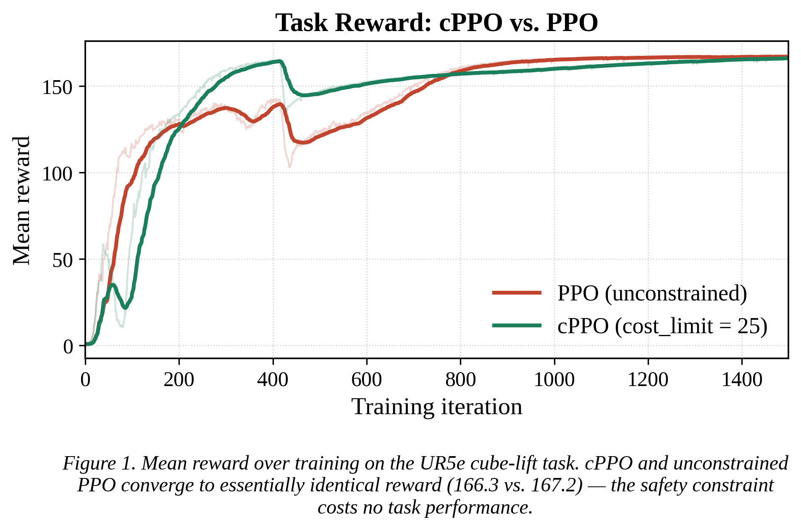
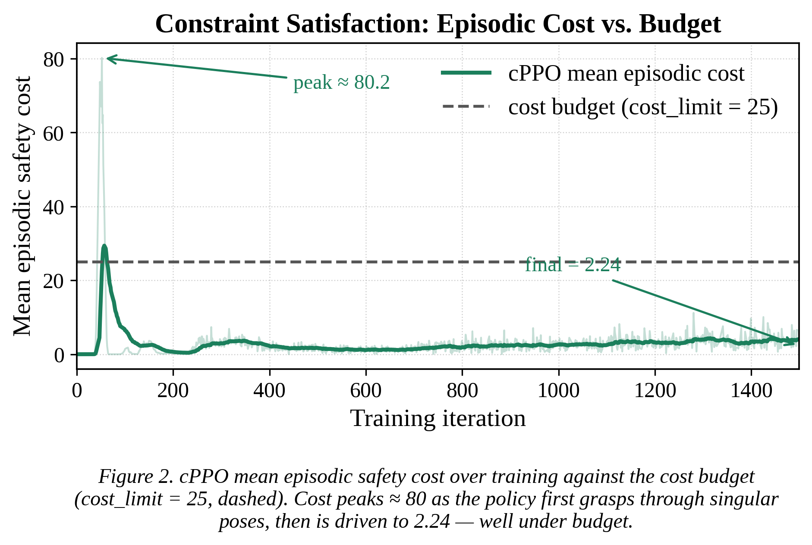
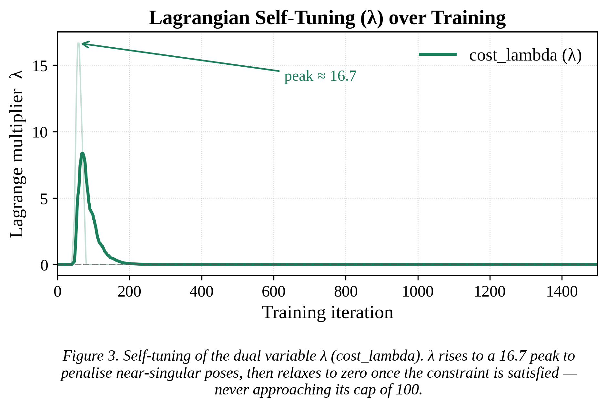
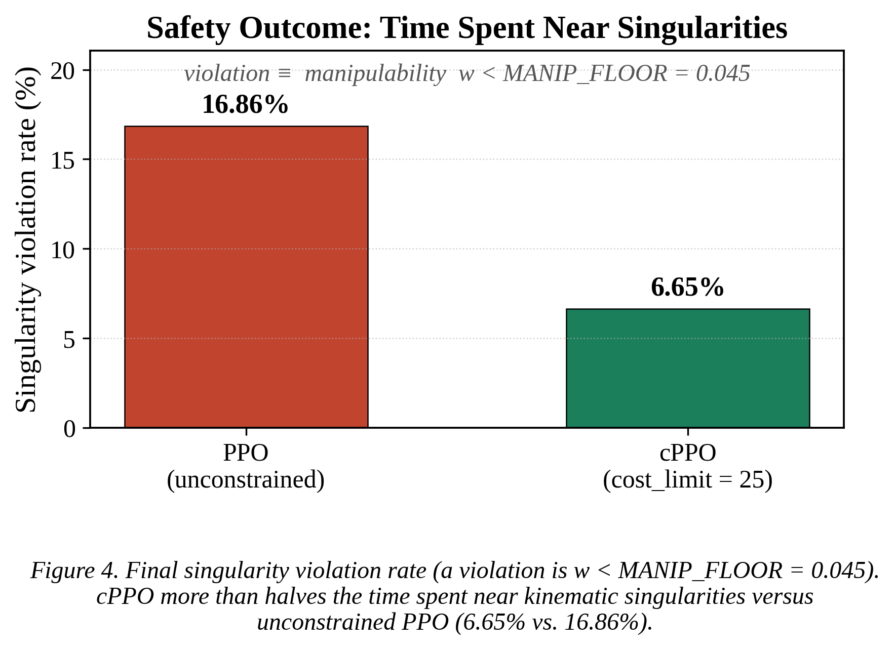

# 06 — Results & Experiments

**Status:** ✅ Layer 1 benchmark complete (2026-07-19); foundation + calibration done. Layer 2/3 pending.

This page collects the **reproducible experiment configs** and the **results** in one place, so a
reader can both re-run each experiment and see what it produced. Numbers marked `PENDING` are filled
in when the corresponding run completes.

---

## How to reproduce any run

All training uses the same launcher, differing only in flags. Run from
`~/Abdur_Rabbi_THESIS/IsaacLab` inside tmux, env `isaaclab` active.

| Experiment | Command (key flags) | Log dir |
|------------|---------------------|---------|
| Cartpole (stack validation) | `train.py --task Isaac-Cartpole-v0 --headless` | `logs/rsl_rl/cartpole` |
| Franka reach (loop validation) | `train.py --task Isaac-Reach-Franka-v0 --headless` | `logs/rsl_rl/…reach…` |
| PPO baseline (grasp, weld) | `../ur5_grasp/scripts/train.py --task Isaac-Lift-Cube-UR5e-v0 --headless --num_envs 4096` | `logs/rsl_rl/ur5e_lift` |
| **cPPO (safe RL)** | `…train.py --task Isaac-Lift-Cube-UR5e-v0 --agent rsl_rl_cppo_cfg_entry_point --headless --num_envs 4096` | `logs/rsl_rl/ur5e_lift_cppo` |

View any of them: `tensorboard --logdir logs/rsl_rl --port 6006 --bind_all` (multiple runs overlay
automatically).

### Measuring grasp success rate

Training does **not** log a success scalar, so the success-rate numbers in the benchmark table are
produced *after* training by replaying each checkpoint with `ur5_grasp/scripts/eval_success.py`. It
scores two rates using the env's own lift/goal math: **lift success** (cube raised above
`--min_height`) and **goal-reach** (lifted *and* within `--success_tol` of the goal). Run both agents
and compare (from `~/Abdur_Rabbi_THESIS/IsaacLab`, inside tmux):

```bash
# cPPO checkpoint
./isaaclab.sh -p ../ur5_grasp/scripts/eval_success.py \
    --task Isaac-Lift-Cube-UR5e-Play-v0 --agent rsl_rl_cppo_cfg_entry_point \
    --headless --num_envs 64 --episodes 512 --min_height 0.1 --success_tol 0.01

# PPO baseline checkpoint (default agent)
./isaaclab.sh -p ../ur5_grasp/scripts/eval_success.py \
    --task Isaac-Lift-Cube-UR5e-Play-v0 \
    --headless --num_envs 64 --episodes 512 --min_height 0.1 --success_tol 0.01
```

**Expected (the reported numbers):** cPPO 100.0% lift / 99.6% goal-reach; PPO 100.0% / 100.0%. Each
loads the newest checkpoint for its experiment automatically.

---

## Validation results (foundation) — ✅ done

| Test | Result |
|------|--------|
| Cartpole | Converged ~150 iters (~17 s on RTX 5090); mean episode length 300 (cap); learned (time_out 0.999) |
| Franka reach | Reward climbs sharply, plateaus ~400 iters; episode length stable |
| num_envs sweep (reach) | Sweet spot ~8192 (throughput vs VRAM); grasp env run at 4096 |

---

## Layer 1 — PPO baseline (grasp) — ✅ trained

- Weld env, 4096 envs, ~1500 iters, clean (no NaN).
- `mean_reward` 0.7 → ~8+ ; `lifting_object` term rises → arm grasps and lifts.
- **Visual `play.py` check must pass** (real reach-grasp-lift, no flinging) before the run is
  trusted.

---

## Layer 1 — Calibration — ✅ done

From a 25.6k-sample baseline rollout (`calibrate_manipulability.py`):

| Constraint | Baseline distribution | Threshold | Active? |
|------------|----------------------|-----------|:-------:|
| Manipulability `w` | min .021 / mean .055 / max .114 | `MANIP_FLOOR = 0.045` (~20% viol.) | **YES** |
| Joint-limit clearance | min 1.39 rad | margin 0.10 | monitored (satisfied) |
| Min link height | min 0.125 m | floor 0.0 | monitored (satisfied) |

Cost budget: **`cost_limit = 25`** (validated by a 50-iter probe; λ self-engaged 0 → 6.85,
controlled).

---

## Layer 1 — The headline benchmark (cPPO vs PPO) — ✅ DONE (2026-07-19)

Two 1500-iter runs at 4096 envs; success measured over 512 evaluation episodes (64 envs,
lift > 0.1 m above table, goal-reach within 1 cm). Result table:
`results/03_cppo_vs_ppo_results.docx` (Times New Roman 14, centred caption).

| Metric | PPO (unconstrained, floor 0.045) | cPPO (`cost_limit = 25`) |
|--------|:--------------------------------:|:------------------------:|
| Lift success rate (%) | 100.0 | 100.0 |
| Goal-reach success rate (%) | 100.0 | 99.6 |
| Final mean reward | 167.2 | 166.3 |
| Singularity violation rate (`safety/viol_singularity`, %) | 16.86 | 6.65 |
| Mean per-step safety cost (`safety/cost_total`) | 0.0201 | 0.0149 |
| Joint-limit / collision violation (%) | 0.0 / 0.0 | 0.0 / 0.0 |
| Final `cost_lambda` | n/a | 0.0 |

**cPPO Lagrangian dynamics:** `mean_episode_cost` peaked ≈ 80.2 → driven to 2.24 (under budget 25);
`cost_lambda` rose to a 16.7 peak (cap 100, never railed) → relaxed to 0; `viol_singularity` fell
from a 51.7 % peak to 6.65 %.

**Story (confirmed):** cPPO matches PPO on the task — both grasp on ~100 % of episodes at essentially
the same reward — while spending less than half the time in near-singular configurations. The safety
constraint is earned at no measurable task cost.

---

## Layer 1 — Results-chapter write-up (draft prose)

> Draft for the thesis Results chapter. Refers to Table 1 (the docx above). Prose only, no lists,
> per the thesis formatting rules.

The constrained policy (cPPO) was benchmarked against an unconstrained PPO baseline on the UR5e
cube-lift task. To isolate the effect of the safety constraint, both agents were trained with the
identical environment, reward function, network architecture, and training budget (1500 iterations
at 4096 parallel environments on an RTX 5090); the only difference between them is the Lagrangian
cost mechanism. The single active safety constraint is the Yoshikawa manipulability measure
w = √det(JJᵀ), with a violation declared whenever w falls below the calibrated floor of 0.045, a
threshold at which the unconstrained baseline spends roughly one fifth of its time. The episodic
cost budget was set to 25. Task success was evaluated over 512 held-out episodes, with a lift
counted successful when the cube is raised more than 0.1 m above the table and a goal-reach counted
successful when the lifted cube is additionally brought within 1 cm of the commanded goal pose.

The two agents are statistically indistinguishable on task performance. Both lift the cube on 100 %
of evaluation episodes, and their goal-reach rates (100.0 % for PPO, 99.6 % for cPPO) and final mean
rewards (167.2 and 166.3) differ only marginally, well within run-to-run variation. This shows that
adding the safety constraint does not degrade the manipulator's ability to grasp and place the
object.

The agents diverge sharply on safety. The unconstrained baseline enters near-singular configurations
16.86 % of the time, whereas cPPO reduces this to 6.65 %, a relative decrease of about 60 %, and its
mean per-step safety cost is correspondingly lower (0.0149 versus 0.0201). The two monitored
constraints, joint-limit proximity and table collision, are never triggered by either agent
(0.0 %), because the tabletop workspace keeps the arm far from its joint limits and from the table
surface throughout the task; they are reported for completeness and confirm that the manipulability
term is the operative constraint. The behaviour of the Lagrangian machinery over training explains
how this margin is obtained: the mean episodic cost rises to a peak of roughly 80 as the policy
first learns to grasp through singular poses, at which point the dual variable λ climbs to a peak of
16.7 and penalises those poses; the policy then reshapes its motion to lower the cost to 2.24, well
under the budget of 25, and with the constraint satisfied λ relaxes back to zero. The multiplier
never approaches its ceiling of 100, indicating that the constraint is enforced smoothly rather than
by saturation.

Taken together, these results establish the Layer 1 claim: constrained reinforcement learning buys a
substantial safety margin — more than halving the time spent near kinematic singularities — at no
measurable cost to grasping success or task reward, which is precisely the trade-off a safe
manipulation policy is meant to deliver.

---

## Figures (for the write-up) — ✅ generated 2026-07-20

Exported to `assets/` (PNG at 300 dpi + vector PDF). Regenerate any time with
`results/scripts/make_layer1_figs.py`.

**Figure 1 — reward overlay** (`assets/fig_reward_ppo_vs_cppo.png`)



**Figure 2 — episodic cost vs. budget** (`assets/fig_cost_vs_budget.png`)



**Figure 3 — Lagrangian λ dynamics** (`assets/fig_lambda_dynamics.png`)



**Figure 4 — singularity violation rates** (`assets/fig_violation_rates.png`)



> Formatting reminder for exported figures/tables: centre-aligned, centre-aligned captions, a few
> purposeful colours only.
